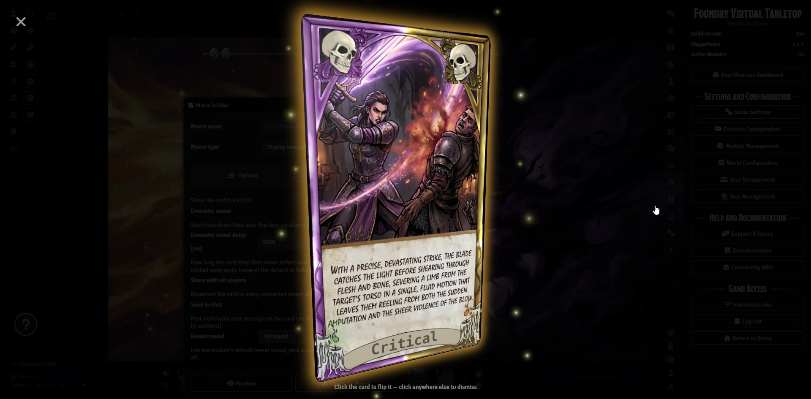
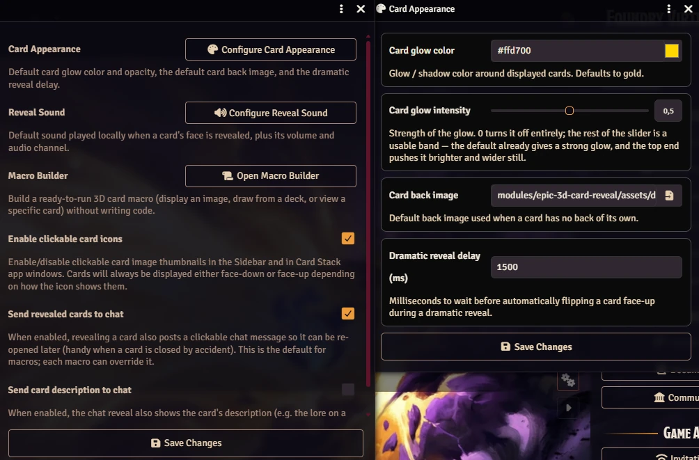
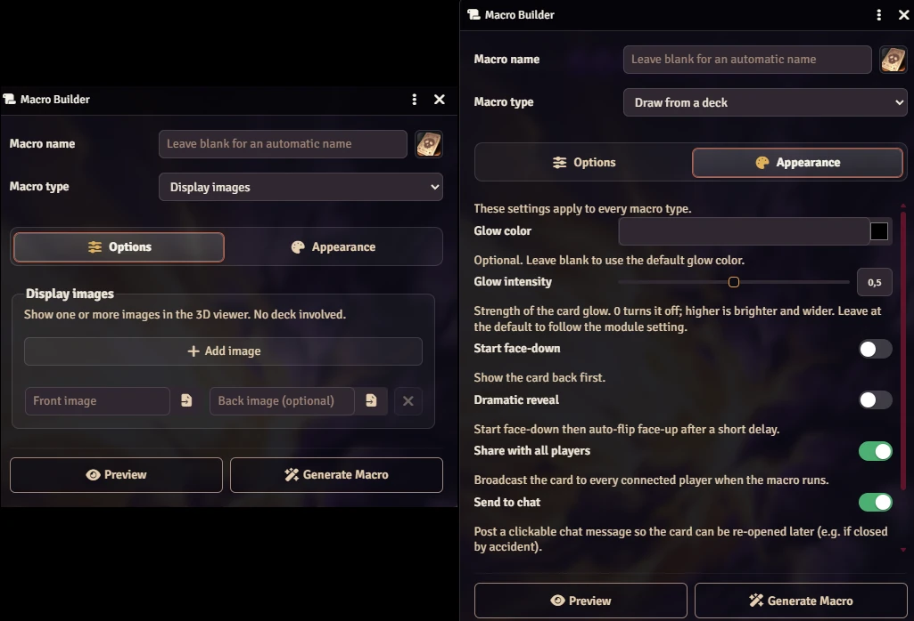

# 🃏 Epic 3D Card Reveal

**A Foundry VTT module that makes every card draw feel like a moment**

> 🌐 [Leia em Português do Brasil](docs/README-ptbr.md)

Drawing a card from the Deck of Many Things should be a *table-stopping event* — not a tiny thumbnail in a sidebar. **Epic 3D Card Reveal** turns every card into a gorgeous full-screen showpiece: the card floats in front of a dimmed screen, tilts in 3D as you move your mouse, catches the light with a subtle glint, and flips over with a satisfying animation — complete with a triumphant chime — when you click it.




[](https://buymeacoffee.com/mestredigital)

## ✨ What it does

- 🖥️ **Full-screen 3D viewer** — cards hover over a dimmed backdrop with sparkles, a glowing aura, and a light glint that follows your cursor.
- 🔄 **Click to flip** — see the card art on one side, the card text on the other.
- 🔊 **Triumphant reveal chime** — a victory sound rings out the moment a card's face is revealed, making every draw feel earned. (Fully configurable — pick your own sound, or mute it.)
- 🖐️ **Hands fan out** — draw several cards at once and they spread into a graceful 3D arc, just like holding a real hand.
- 🔍 **Spotlight one card** — right-click any card in a hand to enlarge it on its own; right-click again to bring the whole hand back.
- 👁️ **Share with one click** — love what you drew? Hit the eye button and *everyone at the table* instantly sees your card. Players can share too, not just the GM.
- 🎭 **Dramatic reveal** — cards can appear face-down and flip themselves over after a suspenseful pause.
- 🔮 **Reversed cards (Tarot-style)** — give a macro a reversal chance and each card has that percent chance of landing upside-down, just like a real Tarot pull. The card text never changes — the meaning is read from the orientation. Off by default; turn it on per macro (or with the Macro Builder's *Reversed chance* slider).
- 💬 **Never lose a card** — every card you view is quietly whispered to the GM in chat. Shared cards are posted publicly, so anyone can click the chat thumbnail to admire them again later.
- 🖱️ **Click any card thumbnail** — in the sidebar, in a deck window, or in chat — and it opens in the viewer.

## 🚀 How to use it

1. 📦 Install the module and enable it in your world.
2. 🗂️ Open any deck of cards and **click a card's image** — it opens in the 3D viewer.
3. 🃏 **Click the card** to flip it. **Click anywhere else** to dismiss it.
4. 🔍 Drew more than one card? **Right-click** a card to spotlight it on its own, and right-click again to fan the hand back out.
5. 👁️ Click the **eye button** in the top corner to show the card to everyone. (The button only appears when the card isn't already being shown to all.)

That's it. No configuration needed — it looks great out of the box.

## ⚙️ Settings



| Setting | Default | What it does |
|---|---|---|
| 🖱️ Enable clickable card icons | On | Makes card thumbnails in the sidebar, deck windows, and chat open the 3D viewer. |
| 💬 Send revealed cards to chat | On | Posts a clickable card preview to chat — whispered to the GM when a card is viewed privately, public when it's shared. |
| 📜 Send card description to chat | Off | Adds the card's description to the chat preview — perfect for lore decks like the PF2e Harrow Deck. Reads the Card's own description field and renders its rich text and links. Cards with no description (and plain images shown via the API) are unaffected. |

The three menus below are GM-only and let you set the defaults for your whole world:

### 🎨 Card Appearance menu

Click **Configure Card Appearance** in the module settings to open a dedicated window where you can style your cards:

- 🌟 **Card glow color & opacity** — the glow is the card's frame: choose its color with a color picker and dial its transparency with a slider (slide to `0` to turn the glow off and leave the card edgeless).
- 🂠 **Card back image** — the default back shown when a card doesn't have one of its own.
- ⏱️ **Dramatic reveal delay** — how long a card stays face-down before auto-flipping during a dramatic reveal.

### 🔊 Reveal Sound menu

Click **Configure Reveal Sound** to choose the sound that plays when a card is revealed:

- 🎵 **Reveal sound** — pick any audio file, or leave it blank to play no sound at all.
- 🔉 **Volume** and **audio channel** — set how loud it is and which mixer channel it uses.
- ♻️ A **Reset to Defaults** button restores the original chime at any time.

### 📜 Macro Builder



Not a coder? Click **Open Macro Builder** to fill in a simple form and get a ready-to-run macro that displays any image — or draws from one of your decks — as a full 3D card. No scripting required.

## 💬 How chat works

- 👁️‍🗨️ **View a card privately** → a preview is whispered to the GM, so the GM always knows what was drawn and can re-open it anytime.
- 📢 **Share a card with everyone** → the preview is posted publicly in chat, so any player can click it later to view the card again on their own screen.
- 🙈 **Face-down stays secret** → a card shown face-down isn't posted to chat until you flip it face-up (or it auto-flips during a dramatic reveal), so the front never appears in chat before the reveal.
- 📜 **Card lore in chat (optional)** → turn on **Send card description to chat** and the preview also carries the card's description — its rich text and links rendered in place. Great for decks like the PF2e Harrow, where every card tells a story.

## 🧙 For macro and module authors

Want to show any image as a gorgeous 3D card from a macro, or build on top of the viewer? The viewer is scriptable through the `EpicCards` global.

- 🖼️ **`EpicCards.Display(...)`** — the core feature: render *any* image with the animated 3D presentation.
- 🃏 **`EpicCards.Dealer(...)`** — an optional helper for when you're working with real card decks. It ties Foundry's card logic (drawing into a discard pile, finding a card across stacks) to the viewer, so your macro or module can move cards **and** show the animated card in one step — no need to reimplement the deck/pile plumbing yourself.

Prefer not to write code? Open the **Macro Builder** (module settings → **Open Macro Builder**, or call `EpicCards.MacroBuilder()`) to generate a finished macro from a form.

See **[docs/API.md](docs/API.md)** for the full reference and ready-to-paste macro examples.

---

# Installation

1. Open Foundry VTT and go to **Add-on Modules**.
2. Click **Install Module**.
3. Paste the manifest URL below and click **Install**.

```
https://raw.githubusercontent.com/brunocalado/epic-3d-card-reveal/main/module.json
```

4. Enable the module in your world via **Manage Modules**.

---

# Bug Reports & Feature Requests

https://github.com/brunocalado/epic-3d-card-reveal/issues

---

# Credits and License

- Released under the [LICENSE](LICENSE).
- This module is a fork/rewrite of [orcnog-card-viewer](https://github.com/orcnog/orcnog-card-viewer), which took its visual inspiration from a popular 5e toolset.
- [reveal.ogg](https://pixabay.com/sound-effects/musical-victory-chime-366449/)
- [demo-card.webp and demo-card-back.webp](https://pixabay.com/illustrations/lion-wild-animal-abstract-1015153/)