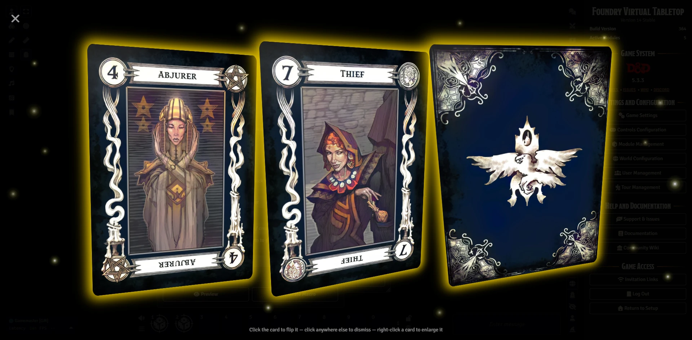

# 🃏 Epic 3D Card Reveal

**Um módulo para Foundry VTT que transforma cada carta sacada em um momento especial**

> 🌐 [Read this in English](../README.md)

Sacar uma carta do Baralho das Muitas Coisas deveria ser um *evento que para a mesa* — e não uma miniatura minúscula na barra lateral. O **Epic 3D Card Reveal** transforma cada carta em um espetáculo deslumbrante em tela cheia: a carta flutua diante de uma tela escurecida, inclina-se em 3D conforme você move o mouse, reflete a luz com um brilho sutil e vira com uma animação satisfatória — acompanhada de um toque triunfante — quando você clica nela.




[](https://buymeacoffee.com/mestredigital)

## ✨ O que ele faz

- 🖥️ **Visualizador 3D em tela cheia** — as cartas pairam sobre um fundo escurecido com brilhos, uma aura reluzente e um reflexo de luz que segue o seu cursor.
- 🔄 **Clique para virar** — veja a arte da carta de um lado e o texto da carta do outro.
- 🔊 **Toque triunfante de revelação** — um som de vitória soa no momento em que a face de uma carta é revelada, fazendo cada saque parecer conquistado. (Totalmente configurável — escolha o seu próprio som ou silencie-o.)
- 🖐️ **Mãos em leque** — saque várias cartas de uma vez e elas se espalham em um gracioso arco 3D, como se você segurasse uma mão de verdade.
- 🔍 **Destaque uma carta** — clique com o botão direito em qualquer carta de uma mão para ampliá-la sozinha; clique novamente com o botão direito para trazer a mão inteira de volta.
- 👁️ **Compartilhe com um clique** — gostou do que sacou? Aperte o botão de olho e *todos na mesa* veem a sua carta instantaneamente. Os jogadores também podem compartilhar, não apenas o GM.
- 🎭 **Revelação dramática** — as cartas podem aparecer viradas para baixo e se virar sozinhas após uma pausa de suspense.
- 🔮 **Cartas invertidas (estilo Tarô)** — dê a uma macro uma chance de inversão e cada carta terá essa porcentagem de chance de cair de cabeça para baixo, como em uma tiragem de Tarô de verdade. O texto da carta nunca muda — o significado é lido pela orientação. Desativado por padrão; ative-o por macro (ou com o controle deslizante *Chance de inversão* do Construtor de Macros).
- 💬 **Nunca perca uma carta** — toda carta que você visualiza é discretamente sussurrada ao GM no chat. As cartas compartilhadas são publicadas publicamente, então qualquer um pode clicar na miniatura do chat para admirá-las novamente depois.
- 🖱️ **Clique em qualquer miniatura de carta** — na barra lateral, na janela de um baralho ou no chat — e ela abre no visualizador.

## 🚀 Como usar

1. 📦 Instale o módulo e ative-o no seu mundo.
2. 🗂️ Abra qualquer baralho de cartas e **clique na imagem de uma carta** — ela abre no visualizador 3D.
3. 🃏 **Clique na carta** para virá-la. **Clique em qualquer outro lugar** para dispensá-la.
4. 🔍 Sacou mais de uma carta? **Clique com o botão direito** em uma carta para destacá-la sozinha e clique novamente com o botão direito para espalhar a mão de volta em leque.
5. 👁️ Clique no **botão de olho** no canto superior para mostrar a carta a todos. (O botão só aparece quando a carta ainda não está sendo mostrada a todos.)

É isso. Não precisa de configuração — fica ótimo já de cara.

## ⚙️ Configurações


| Configuração | Padrão | O que faz |
|---|---|---|
| 🖱️ Ativar ícones de carta clicáveis | Ligado | Faz com que as miniaturas de cartas na barra lateral, nas janelas de baralho e no chat abram o visualizador 3D. |
| 💬 Enviar cartas reveladas ao chat | Ligado | Publica uma prévia clicável da carta no chat — sussurrada ao GM quando uma carta é vista em particular, pública quando é compartilhada. |
| 📜 Enviar descrição da carta ao chat | Desligado | Adiciona a descrição da carta à prévia no chat — perfeito para baralhos de lore como o Harrow Deck do PF2e. Lê o próprio campo de descrição da carta e renderiza seu texto rico e links. Cartas sem descrição (e imagens simples exibidas pela API) não são afetadas. |

Os três menus abaixo são exclusivos do GM e permitem definir os padrões para todo o seu mundo:

### 🎨 Menu de Aparência da Carta

Clique em **Configurar Aparência da Carta** nas configurações do módulo para abrir uma janela dedicada onde você pode estilizar suas cartas:

- 🌟 **Cor e opacidade do brilho da carta** — o brilho é a moldura da carta: escolha sua cor com um seletor de cores e ajuste sua transparência com um controle deslizante (deslize até `0` para desligar o brilho e deixar a carta sem bordas).
- 🂠 **Imagem do verso da carta** — o verso padrão mostrado quando uma carta não tem um próprio.
- ⏱️ **Atraso da revelação dramática** — por quanto tempo uma carta permanece virada para baixo antes de virar automaticamente durante uma revelação dramática.

### 🔊 Menu de Som de Revelação

Clique em **Configurar Som de Revelação** para escolher o som que toca quando uma carta é revelada:

- 🎵 **Som de revelação** — escolha qualquer arquivo de áudio ou deixe em branco para não tocar som algum.
- 🔉 **Volume** e **canal de áudio** — defina o volume e qual canal do mixer ele usa.
- ♻️ Um botão **Restaurar Padrões** restaura o toque original a qualquer momento.

### 📜 Construtor de Macros


Não é programador? Clique em **Abrir Construtor de Macros** para preencher um formulário simples e obter uma macro pronta para uso que exibe qualquer imagem — ou saca de um dos seus baralhos — como uma carta 3D completa. Sem necessidade de programação.

## 💬 Como o chat funciona

- 👁️‍🗨️ **Visualizar uma carta em particular** → uma prévia é sussurrada ao GM, então o GM sempre sabe o que foi sacado e pode reabri-la a qualquer momento.
- 📢 **Compartilhar uma carta com todos** → a prévia é publicada publicamente no chat, então qualquer jogador pode clicar nela depois para visualizar a carta novamente na própria tela.
- 🙈 **Virada para baixo continua secreta** → uma carta mostrada virada para baixo não é publicada no chat até que você a vire para cima (ou ela vire automaticamente durante uma revelação dramática), então a frente nunca aparece no chat antes da revelação.
- 📜 **Lore da carta no chat (opcional)** → ative **Enviar descrição da carta ao chat** e a prévia também carrega a descrição da carta — seu texto rico e links renderizados no lugar. Ótimo para baralhos como o Harrow do PF2e, onde cada carta conta uma história.

## 🧙 Para autores de macros e módulos

Quer mostrar qualquer imagem como uma linda carta 3D a partir de uma macro, ou construir sobre o visualizador? O visualizador é programável através do objeto global `EpicCards`.

- 🖼️ **`EpicCards.Display(...)`** — o recurso principal: renderiza *qualquer* imagem com a apresentação 3D animada.
- 🃏 **`EpicCards.Dealer(...)`** — um auxiliar opcional para quando você está trabalhando com baralhos de cartas reais. Ele conecta a lógica de cartas do Foundry (sacar para uma pilha de descarte, encontrar uma carta entre as pilhas) ao visualizador, então sua macro ou módulo pode mover cartas **e** mostrar a carta animada em um único passo — sem precisar reimplementar a estrutura de baralhos/pilhas você mesmo.

Prefere não escrever código? Abra o **Construtor de Macros** (configurações do módulo → **Abrir Construtor de Macros**, ou chame `EpicCards.MacroBuilder()`) para gerar uma macro pronta a partir de um formulário.

Veja **[docs/API.md](API.md)** para a referência completa e exemplos de macros prontos para colar.

---

# Instalação

1. Abra o Foundry VTT e vá até **Add-on Modules**.
2. Clique em **Install Module**.
3. Cole a URL do manifesto abaixo e clique em **Install**.

```
https://raw.githubusercontent.com/brunocalado/epic-3d-card-reveal/main/module.json
```

4. Ative o módulo no seu mundo através de **Manage Modules**.

---

# Relatos de Bugs & Pedidos de Recursos

https://github.com/brunocalado/epic-3d-card-reveal/issues

---

# Créditos e Licença

- Lançado sob a [LICENSE](../LICENSE).
- Este módulo é um fork/reescrita do [orcnog-card-viewer](https://github.com/orcnog/orcnog-card-viewer), que se inspirou visualmente em um popular conjunto de ferramentas de 5e.
- [reveal.ogg](https://pixabay.com/sound-effects/musical-victory-chime-366449/)
- [demo-card.webp e demo-card-back.webp](https://pixabay.com/illustrations/lion-wild-animal-abstract-1015153/)
